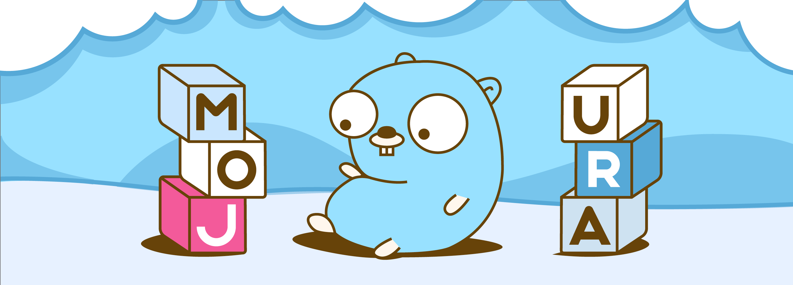

# Mojura

<!-- ALL-CONTRIBUTORS-BADGE:START - Do not remove or modify this section -->
[](#contributors-)
<!-- ALL-CONTRIBUTORS-BADGE:END -->

Mojura is a generic Go database library with filterable relationship indexes. It
stores typed values in a transactional key/value backend, uses Bolt by default,
and integrates Kiroku for history, snapshots, and replication. Relationships are
application-defined secondary indexes, including many-to-many memberships.



## Start here

- [Usage](docs/usage.md): value types, relationships, CRUD, filtering, pagination,
  transactions, and wrappers.
- [Configuration](docs/configuration.md): actual defaults, backend requirements,
  encoders, storage files, history, and mirrors.
- [Development](docs/development.md): source map, verification, and known defects.
- [AGENTS.md](AGENTS.md): repository instructions for coding agents.
- [STYLEGUIDE.md](STYLEGUIDE.md): coding conventions for contributors and agents.

This checkout is a library, with no server, plugin system, CLI, or configuration-file
loader. It does not implement SQL joins, foreign-key enforcement, or cascading deletes.

## Requirements and installation

Use Go 1.25.0 or newer, as declared in [go.mod](go.mod). In an application with its
own Go module:

```sh
go get github.com/mojura/mojura
```

Use `github.com/mojura/mojura` for the database and
`github.com/mojura/mojura/filters` for filter constructors. The checked-in example
uses this module directly and needs no additional `go get` command.

## Run the example

From this repository's root:

```sh
go run ./examples/basic
```

The [complete program](examples/basic/main.go) and its
[record type](examples/basic/record.go) demonstrate creation, reading, filtering,
updating, replacing, iteration, deletion, and close/error handling. It creates a
fresh temporary directory and removes it after closing. No external service or
configuration file is needed.

Expected application output:

```text
Created 00000000
Read: Hello, Mojura!
Owner matches: 1
Updated: Updated message
Put: Replaced message
Iterated 00000000: Replaced message
Exists after delete: false
```

For persistent storage, create a directory and pass it to
`mojura.MakeOpts("messages", dir)`, then call
`mojura.New[*record](opts, "owners", "tags")`. `MakeOpts` takes name first, directory
second; `New` fills defaults. Close every successfully opened database and handle
its close error. The default backend opens `<dir>/messages.bdb`; Kiroku also creates
metadata and working history files. A nil `Source` does not configure a retained
history backup. See [storage configuration](docs/configuration.md#backend-and-files).

## The value and query model

Embed `mojura.Entry` by value in a concrete type and pass its pointer type to `New`.
Override `GetRelationships` with a fixed number of slots matching the relationship
keys passed to the constructor, in the same order. This must work for a zero value,
including when all relationship IDs are empty. The example maps its `OwnerID` to
`owners` and its `Tags` to `tags`.

This query fragment uses the example's opened database and record type:

```go
query := mojura.NewFilteringOpts(filters.Match("owners", "user_1"))
var (
	matches []*record
	lastID  string
	err     error
)
if matches, lastID, err = db.GetFiltered(query); err != nil {
	return err
}
```

`NewFilteringOpts` defaults to unlimited collection. A zero-value `FilteringOpts`
sets `Limit` to zero and collects nothing. Multiple filters intersect, with the
first controlling traversal. Comparisons use string ordering; entries can repeat
when traversing multiple relationship memberships. `Put` is an upsert; `Update`
requires an existing entry. See [the usage guide](docs/usage.md) for complete contracts.

## Current limitations

Read [known defects](docs/development.md#known-defects-and-limitations) before using
batching, advanced pagination/ranges, encrypted decoding, or mirror recovery.
Confirmed issues include a batch size-triggered hang, unfiltered continuation-token
failures, range-boundary errors, and short-input panics in the encrypted encoder.
Inverse-filter behavior also depends on filter position for multi-valued or absent
memberships. Snapshot/delete replay and resource cleanup have additional gaps
identified in source review. These are documented existing behaviors, not guarantees
that those features work in every case.

## Development checks

From the repository root:

```sh
go test ./...
go vet ./...
go build ./...
```

Run `gofmt -w` on changed Go files and `go test -race ./...` for concurrency or
lifecycle changes. The pinned Bolt dependency currently aborts the race check with
`checkptr` on the audited macOS arm64 toolchain. See the
[development guide](docs/development.md#verification) for details and restricted
cache commands. Tests share `./test_data`; do not store real data there or run
separate test processes concurrently in this checkout.

Contributions use [PULL_REQUEST_TEMPLATE.md](PULL_REQUEST_TEMPLATE.md).
Mojura is distributed under the [MIT license](LICENCE).

## Contributors ✨

Thanks goes to these wonderful people ([emoji key](https://allcontributors.org/docs/en/emoji-key)):

<!-- ALL-CONTRIBUTORS-LIST:START - Do not remove or modify this section -->
<!-- prettier-ignore-start -->
<!-- markdownlint-disable -->
<table>
  <tr>
    <td align="center"><a href="http://itsmontoya.com"><br /><sub><b>Josh</b></sub></a><br /><a href="https://github.com/mojura/mojura/commits?author=itsmontoya" title="Code">💻</a> <a href="https://github.com/mojura/mojura/commits?author=itsmontoya" title="Documentation">📖</a></td>
    <td align="center"><a href="https://github.com/dhalman"><br /><sub><b>Derek Halman</b></sub></a><br /><a href="https://github.com/mojura/mojura/commits?author=dhalman" title="Code">💻</a></td>
    <td align="center"><a href="https://github.com/russiansmack"><br /><sub><b>Sergey Anufrienko</b></sub></a><br /><a href="https://github.com/mojura/mojura/commits?author=russiansmack" title="Code">💻</a></td>
    <td align="center"><a href="http://mattstay.com"><br /><sub><b>Matt Stay</b></sub></a><br /><a href="#design-matthew-stay" title="Design">🎨</a></td>
    <td align="center"><a href="https://github.com/BrandenWilliams"><br /><sub><b>BrandenWilliams</b></sub></a><br /><a href="https://github.com/mojura/mojura/pulls?q=is%3Apr+reviewed-by%3ABrandenWilliams" title="Reviewed Pull Requests">👀</a></td>
  </tr>
</table>

<!-- markdownlint-restore -->
<!-- prettier-ignore-end -->

<!-- ALL-CONTRIBUTORS-LIST:END -->

This project follows the [all-contributors](https://github.com/all-contributors/all-contributors) specification. Contributions of any kind welcome!
